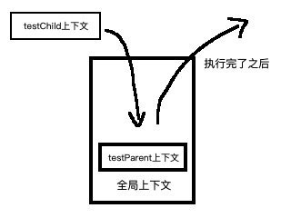
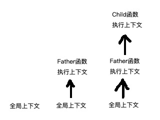

# 执行上下文与作用域链

在 es 中有执行上下文的概念，变量和函数的执行上下文决定了它能访问到的数据有哪些。每个上下文都有自己对应的一个上下文对象，在当前上下文内定义的变量和函数都属于这个对象的。尽管代码无法访问到这个对象，但理论上是这样的。（红宝书第四版第四章）

## 全局上下文

从程序开始执行，就会建立起一个最外层的全局上下文，这个全局上下文是根据宿主环境来决定的，比如如果是浏览器那么就是 window，如果是 nodejs 那就是 global。使用 var 在顶层作用域定义的变量和函数都会变成全局上下文所属的属性和方法，而用 let 和 const 在顶层定义的变量和函数则不属于全局上下文，但在作用域链上的作用却是一样的。

## 上下文工作流程

当每个函数调用的时候，函数都会有自己的执行上下文，这个上下文被压入上下文栈中，当函数代码执行完毕了之后这个上下文就会被从栈中弹出并销毁，包括在这个上下文上定义的变量和函数都会被销毁（闭包等情况除外），当前控制权回到栈内的上一个上下文。如下图所示

```javascript
let testChild = function () {};
let testParen = function () {
  // 父函数内部执行子函数，子函数的上下文压入父函数上方
  testChild();
};
// 执行父函数，父函数的上下文压入栈内
testParent();
```



## 作用域链

当每个执行上下文的代码在执行的时候，都会产生一个该上下文对应的作用域链，这个链决定了上下文能够访问到的变量和方法的范围。通常当前上下文会位于作用域链的最前端，后一个链上的节点即为包含当前上下文的上下文栈中的上一个上下文的变量对象，以此往外推直到找到你所要访问的变量或者直到全局上下文都没找到然后报错。如下代码：

```javascript
// 全局上下文
var grandpa = "Peter";
function Father() {
  // Father函数的上下文
  let father = "Mike";
  // 通过作用域链在上一层全局上下文找到了grandpa变量
  console.log("grandpa is " + grandpa);
  let Child = function () {
    // Child函数的上下文
    let child = "Tom";
    // 通过Child函数的作用域链在上一层上下文找到了father变量
    console.log("father is " + father);
    // 通过Child函数的作用域链在上上一层上下文找到了grandpa变量
    console.log("grandpa is " + grandpa);
  };
}
```

下图是作用域链的示意图



同时要注意的是一个函数的参数也被认为是处在当前函数的执行上下文的作用域中的变量。
