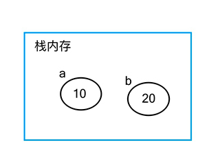

# 数据类型和数据类型的判断

<br/>

## 一、数据类型

在 ECMAScript 中，变量可以包含两种不同的类型的数据————**原始值和引用值**。

### 1、原始值变量

_常见的数据类型有_：Number 数值类型、Boolean 布尔类型、String 字符串类型、Symbol 符号类型、undefined 和 null 这么几种。

原始值变量是保存在栈内存中，按值访问的，因为我们操作这个变量操作的就是存在变量中实际的值。因此在当复制变量的时候，实际上也是在内存中重新开辟了一块存储了新的变量副本，二者之间并不会产生影响。如下代码：

```javascript
// Number类型变量
let a = 10;
let b = a;

// 当我们修改b时，并不会影响到a，因为他们是不同的变量
b = 20;
console.log(a, b); // 10 20
```

正如下图所示，栈内存中保存的直接就是原始值变量的值



### 2、引用值变量

_常见的数据类型有_：Object 对象、Array 数组、Function 函数、Date 内置日期对象等。

引用值变量并不是像原始值变量那样直接将值保存在栈内存中，而是保存在堆内存中，而栈内存中存储的则是该变量在堆内存中的存储地址。

因为引用值变量的大小是会改变的，把它放在栈内存中会降低变量查询速度，但是引用地址所占空间是固定的，所以变量里实际上存储的是引用地址。因此当引用值变量进行简单复制的时候，实际上是将它的引用地址复制给了新变量，而两个变量指向的还是同一个堆内存中的数据，他们任意一个在修改的时候都会影响到另一个。如下代码演示：

javascript 不允许直接访问内存位置，因此不能直接操作对象所在的堆内存空间，在操作该变量时操作的是其中的引用地址。

```javascript
let obj1 = { name: "winter", age: 29 };
let obj2 = obj1;
//此时把obj1中存放的存储地址复制给了obj2，因此obj2也指向了winter的那个对象

obj2.age = 30;
console.log(obj1); // 此时你会发现obj1打印出来的结果也是30岁
```

正如下图所示：


<br/>
<br/>

## 二、如何判断变量的数据类型

### 1、typeof

typeof 是一个判断变量数据类型的操作符，基本用法就是如下代码所示

```javascript
let a = 10;
let str = "winter";
let flag = true;
let temp;
let obj = { name: "winter" };
let arr = [1, 2, 3];
const func = function () {};
// 打印结果如下
console.log(typeof a); // "number"
console.log(typeof str); // "string"
console.log(typeof flag); // "boolean"
console.log(typeof temp); // "undefined"
console.log(typeof func); // "function"
console.log(typeof obj); // "object"
console.log(typeof arr); // "object"
```

如上代码所示，typeof 操作符对于基本值变量判断是好用的，但对于引用类型数据判断就统一返回了 object 结果，这样肯定不行的。

### 2、instanceof

instanceof 是一个运算符，它的作用是返回某个构造函数的原型对象 prototype 是否存在于要检测的参数实例的原型链上。从定义上就可以看出，这个运算符对于基本值变量是没有效的，对于有原型对象原型指针原型链的引用值变量是可以的，实际上它也可以判断自己定义的原型实例。如下代码所演示：

```javascript
let a = 10;
let obj = { name: "winter" };
let arr = [1, 2, 3];
const Animal = function(){};
let cat = new Animal();
// 打印结果如下
console.log(a instansof Number); // "false，判断基本类型会返回false无法判断"
console.log(obj instanceof Object); // "true"
console.log(arr instanceof Array); // "true"
console.log(cat instanceof Animal); // "true"
```

### 3、toString

在 Object 的原型方法中 toString 是返回一个字符串[object `type`]，此处的`type`为 Object，即它的类型字符串，如下所示：

```javascript
let obj = {};
console.log(obj.toString());
// 打印结果为 [object Object]
```

而 js 中所有都继承自 Object，所以它们也有 toString 方法，一般调用都会返回它的类型，前提是这个方法没有被重写覆盖。但是很多数据类型都重写了该方法，例如 Array 类型如下：

```javascript
let arr = [1, 2, 3];
console.log(arr.toString());
// 打印结果为 1,2,3。这就是方法被重写了。
```

因此在这种情况下就需要调用原本没有被重写过的 Object.prototype.toString 方法，同时通过 call 或 apply 去改变 this 指向，来输出想要的类型字符串。如下：

```javascript
let a = 10;
let arr = [1, 2, 3];
let obj = {};
// 此处因为原本调用太长，在这里进行一个封装
const check = Object.prototype.toString;
console.log(check.call(a)); // [object Number]
console.log(check.call(arr)); // [object Array]
console.log(check.call(obj)); // [object Object]
```

具体更详细的可以看[这篇文章](https://zhuanlan.zhihu.com/p/118793721)
