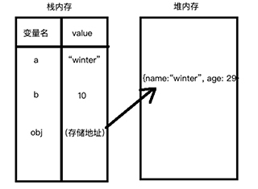
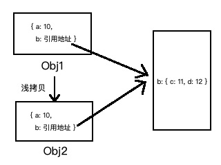

# 浅谈浅拷贝与深拷贝

## 前导知识

### 1、基本类型和引用类型的保存形式

对于基本类型变量来说，栈内存中保存的是该变量对应的值；而对于引用类型的变量来说，他的值是保存在了堆内存中，而栈内存中存储的是该变量的值在堆内存中的存储地址。如下示意图所示：



### 2、关于赋值（=）

对于用=符号来进行变量的赋值操作，分为两种情况。

第一种就是给基本类型变量赋值，当将一个基本类型变量赋值给另一个变量时，就是把这个变量栈内存中的值赋值给了新变量，与浅拷贝和深拷贝相同，二者不会影响。如下所示：

```javascript
let a = 10;
let b = "winter";

let x = a;
let y = b;
console.log(a, b, x, y); // 10 "winter" 10 "winter"

x = 20;
y = "wan";
console.log(a, b, x, y); // 10 "winter" 20 "wan"
// 修改新变量不会影响老的变量
```

第二种就是给引用类型变量赋值，当将一个引用类型变量赋值给另一个变量时，就是把这个变量栈内存中的存储指向地址赋值给了新变量，新变量的 value 也指向了堆内存中同一个存储值。二者相互影响，任何修改都会影响到另外一个。如下所示：

```javascript
let obj1 = { name: "winter", age: 29, grade: { chinese: 90, math: 100 } };
let obj2 = obj1;
console.log(obj1, obj2); // 二者打印结果一样

obj2.age = 30;
obj2.grade.math = 98;
console.log(obj1, obj2); // 二者打印结果依旧一样
// 对于引用类型变量的赋值实际上就是赋值了栈内存中的那个存储地址，指向的是同一个对象，完全影响
```

<br/>

## 什么是浅拷贝和深拷贝

### 1、浅拷贝

浅拷贝是一次精确拷贝。在浅拷贝中，对于基本类型变量来说，就是直接将栈内存中存储的变量的值拷贝一份副本出来给到新的变量，二者之间无论如何修改都不会相互影响，和赋值相同。而对于引用类型的变量来说，则是与赋值不同的。在浅拷贝一个引用类型变量中，新的对象是在被复制对象的根层级上复制了非引用类型的值和引用类型的引用地址。下面通过一些代码来更加明显的阐述我想进行的表达：

```javascript
let obj1 = {};
let obj2 = obj1; // 赋值
let obj3 = Object.assign({}, obj1); // 浅拷贝
console.log(obj1 === obj2, obj1 === obj3); // true false
```

_由此可以看出引用类型赋值其实复制了指引地址，指向了同一个变量，而浅拷贝实际上是一个新的变量。_

```javascript
let obj1 = { name: "winter", age: 29, grade: { math: 80, english: 90 } };
let obj2 = Object.assign({}, obj1);
console.log(obj1, obj2); // 结果一样
obj2.age = 30;
obj2.grade.math = 95;
console.log(obj1, obj2); // obj1的age没有变，grade的math值变了
```

_这恰恰证明了，在浅拷贝一个引用类型变量的时候，根层级的基本类型是复制了值的副本，而根层级的引用类型变量则是复制了一份引用地址，指向了同一个对象，如下图所示：_



### 2、深拷贝

说完了赋值和浅拷贝，深拷贝的概念其实就可以对比得出。深拷贝就是完全进行拷贝，从堆内存中开辟出一块儿新区域存放，二者不在有相互影响的情况，哪怕是根层级的引用类型变量也进行了拷贝。如下所示：

```javascript
let obj1 = { name: "winter", age: 29, grade: { math: 80, english: 90 } };
let obj2 = deepCopy(obj1);
console.log(obj1, obj2); // 二者打印结果一样

obj2.age = 30;
obj2.grade.math = 95;
console.log(obj1, obj2); // obj2的修改值完全没有作用在obj1中
```

由此可以看出深拷贝出来的 obj2 和 obj1 已经完全是两个不同的变量了，是完完全全的拷贝。

<br/>

## 如何浅拷贝和深拷贝

### 1、如何浅拷贝

_(1)_ Object.assign()方法，是 es6 中拷贝对象的方法，接收两个参数，第一个是拷贝的目标，第二个是拷贝的源对象。
<br/>
_(2)_ Array.prototype.slice，可以实现数组的浅拷贝。具体可以看代码如下：

```javascript
let arr1 = [1, 3, 5, { x: 4 }];
let arr2 = Array.prototype.slice.call(arr1);

console.log(arr1, arr2); // 打印结果一样
arr2[1] = 2;
arr2[3].x = 6;
console.log(arr1, arr2); // [1, 3, 5, {x: 6}] [1, 2, 5, {x: 6}]
```

由上面的代码可以看出根层级的基本类型值进行了拷贝，引用类型拷贝的是引用地址二者修改都会影响对方。因此可以看出该方法对数组变量进行了浅拷贝。
<br/>
_(3)_ Array.prototype.concat，可实现数组的浅拷贝，与 slice 同理。
<br/>
_(4)_ 扩展运算符，扩展运算符同样可以实现浅拷贝，如下代码示意：

```javascript
let arr1 = [1, 3, 5, { x: 7 }];
let arr2 = [...arr1];

let obj1 = { name: "winter", age: 29, grade: { math: 80 } };
let obj2 = { ...obj1 };

console.log(arr1, arr2); // 打印结果一样
console.log(obj1, obj2); // 打印结果一样

arr2[1] = 4;
arr2[3].x = 8;
obj2.age = 30;
obj2.grade.math = 95;

console.log(arr1, arr2); // arr1[1]没有变，但arr1[3].x的值变了
console.log(obj1, obj2); // obj1.age没有变，但obj1.grade.math的值变了
```

_(5)_ 自己实现一个简单的浅拷贝，如下代码所示：

```javascript
const shallowCopy = function (source) {
  let target = {};
  // for-in遍历对象的属性
  for (let key in source) {
    // hasOwnProperty剔除从原型链继承来的属性
    if (Object.prototype.hasOwnProperty.call(source, key)) {
      target[key] = source[key];
    }
  }
  return target;
};
```

### 2、如何深拷贝

_(1)_ JSON 函数，如下代码所示：

```javascript
let obj1 = { name: "winter", age: 29, grade: { math: 80 } };
let obj2 = JSON.parse(JSON.stringify(obj1));

console.log(obj1, obj2); // 打印结果一样
obj2.age = 30;
obj2.grade.math = 95;
console.log(obj1, obj2); // 打印结果obj2变动了，obj1完全没变
```

如上所示，当 obj2 发生改变的时候 obj1 完全没有变，因此这是一个深拷贝。

_(2)_ 自己实现深拷贝，主要是用到递归的思想，先判断类型当非对象类型是返回自身，不是非对象类型的时候运用 for-in 遍历的思想（即实现浅拷贝时的方式）再去遍历。这里不赘叙了...😂

### 3、函数库

例如 lodash...😂
