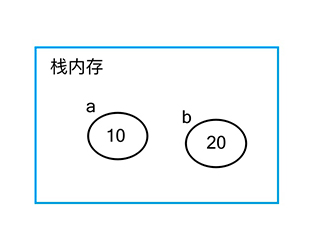
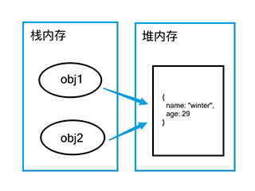

# 数据类型和数据类型的判断

## 一、数据类型

数据类型分为两种不同的类型————**基本数据类型和引用数据类型**。

<br/>

### 1、基本数据类型

_常用的基本数据类型有_：Number 数值类型、Boolean 布尔类型、String 字符串类型、Symbol 符号类型、undefined 和 null 这么几种。

<br/>
基本数据类型是保存在栈内存中，按值访问的，因为他们所占空间是固定的。因此在当复制基本类型变量的时候，实际上也是在内存中重新开辟了一块存储了新的变量副本，二者之间并不会产生影响。如下代码：

<br/>

```javascript
// Number类型变量
let a = 10;
let b = a;

// 当我们修改b时，并不会影响到a，因为他们是不同的变量
b = 20;
console.log(a, b); // 10 20
```

正如下图所示，栈内存中保存的直接就是基本类型变量的值



<br/>

### 2、引用数据类型

_常用的引用数据类型有_：Object 对象、Array 数组、Function 函数、Date 内置日期对象等。

<br/>
引用数据类型也就是对象类型Object type，并不是像基本数据类型那样直接将值保存在栈内存中，而是保存在堆内存中，而栈内存中存储的则是该变量在堆内存中的存储地址。

因为引用数据类型的大小是会改变的，把它放在栈内存中会降低变量查询速度，但是引用地址所占空间是固定的，所以变量里实际上存储的是引用地址。因此当引用变量进行简单复制的时候，实际上是将它的引用地址复制给了新变量，而两个变量指向的还是同一个堆内存中的数据，他们任意一个在修改的时候都会影响到另一个。如下代码演示：

<br/>

```javascript
let obj1 = { name: "winter", age: 29 };
let obj2 = obj1;
//此时把obj1中存放的存储地址复制给了obj2，因此obj2也指向了winter的那个对象

obj2.age = 30;
console.log(obj1); // 此时你会发现obj1打印出来的结果也是30岁
```

正如下图所示：



<br/>
<br/>
<br/>

## 二、如何判断数据类型

### 1、typeof

### 2、instanceof

### 3、toString
